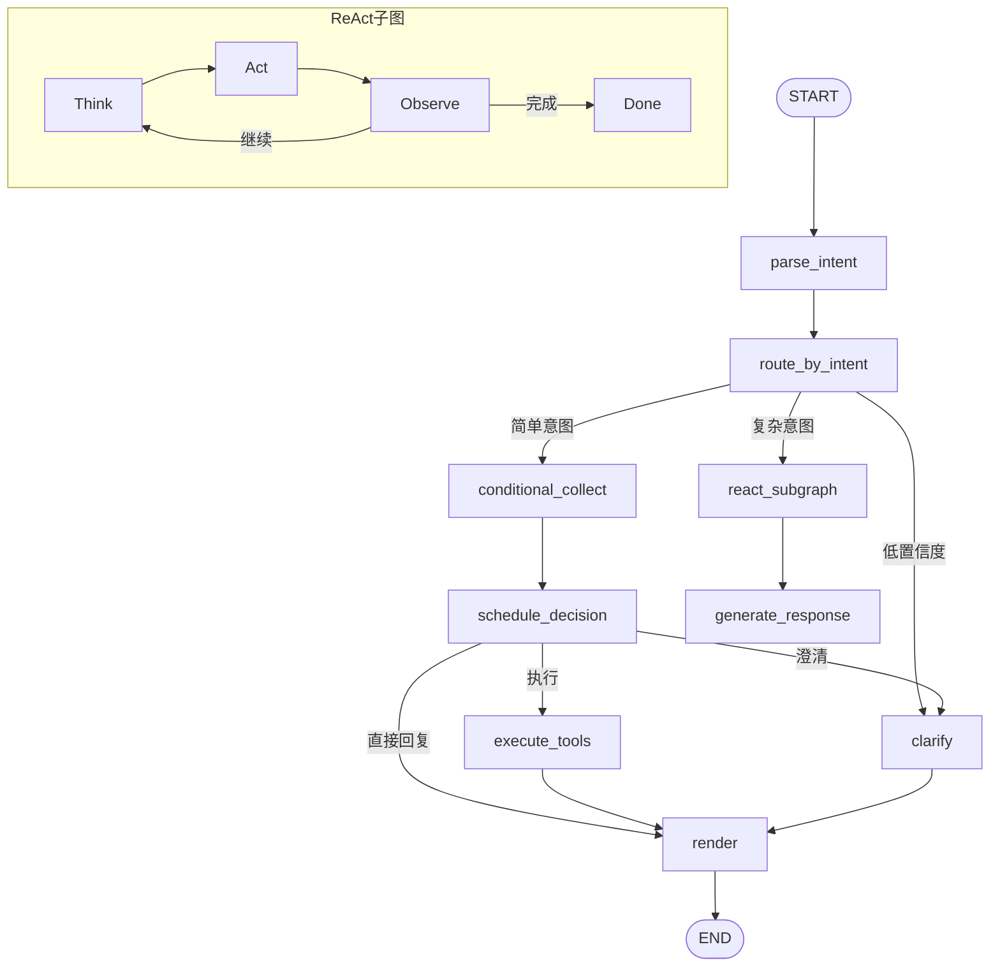

# 个人事务助手系统实现计划 V7 - LangGraph++ 工作流重构与性能优化

> 本文档为AI助手工作流的重构方案，聚焦性能优化、条件化上下文收集、LangGraph++架构（保留扩展性+ReAct子图）、以及工具注册机制。

---

## 目录

- [一、现状总结与问题分析](#一现状总结与问题分析)
- [二、V7 升级目标与架构总览](#二v7-升级目标与架构总览)
- [三、架构选型：为什么选择 LangGraph++](#三架构选型为什么选择-langgraph)
- [四、P0 — 性能优化（立竿见影）](#四p0--性能优化立竿见影)
  - [P0-1: 条件化外部API调用](#p0-1-条件化外部api调用)
  - [P0-2: API超时优化](#p0-2-api超时优化)
  - [P0-3: 事件特定上下文懒加载](#p0-3-事件特定上下文懒加载)
- [五、P1 — LangGraph++ 工作流重构（核心）](#五p1--langgraph-工作流重构核心)
  - [P1-1: 条件化上下文收集节点](#p1-1-条件化上下文收集节点)
  - [P1-2: ReAct子图（复杂场景）](#p1-2-react子图复杂场景)
  - [P1-3: LLM驱动的路由决策](#p1-3-llm驱动的路由决策)
  - [P1-4: 节点职责重构（单一职责）](#p1-4-节点职责重构单一职责)
- [六、P2 — 工具注册与发现机制](#六p2--工具注册与发现机制)
  - [P2-1: 工具注册中心](#p2-1-工具注册中心)
  - [P2-2: 自动注册装饰器](#p2-2-自动注册装饰器)
  - [P2-3: 工具描述生成（用于LLM）](#p2-3-工具描述生成用于llm)
- [七、P3 — 工作流可视化与监控](#七p3--工作流可视化与监控)
  - [P3-1: 执行轨迹记录](#p3-1-执行轨迹记录)
  - [P3-2: 性能指标收集](#p3-2-性能指标收集)
  - [P3-3: 调试接口](#p3-3-调试接口)
- [八、数据库变更清单](#八数据库变更清单)
- [九、依赖与配置变更](#九依赖与配置变更)
- [十、单元测试策略](#十单元测试策略)
- [十一、整体测试验证清单](#十一整体测试验证清单)

---

## 一、现状总结与问题分析

### 1.1 当前AI助手工作流架构

```
用户消息
    ↓
[send_message()]
    ├─ 获取用户Profile、Events、Tasks
    ├─ _build_external_context() ← 无条件调用天气+通勤API
    ├─ _build_plan()
    │   ├─ _classify_intent() ← 规则分类
    │   ├─ Gemini LLM生成计划（或规则fallback）
    │   └─ 返回 {reply, actions}
    ├─ _execute_actions() ← 顺序执行
    │   ├─ 冲突检测（扫描全部事件）
    │   ├─ 创建事件/任务
    │   └─ 同步Google Calendar（阻塞）
    └─ _compose_reply() ← 格式化回复
```

### 1.2 已知性能瓶颈

| 编号 | 瓶颈 | 影响 | 严重程度 |
|------|------|------|----------|
| PB-1 | 天气API无条件调用 | 每条消息都查天气，即使用户说"你好" | 🔴 严重 |
| PB-2 | 通勤API无条件调用 | 同上 | 🔴 严重 |
| PB-3 | API超时20秒 | 网络不佳时单API阻塞20秒 | 🔴 严重 |
| PB-4 | Gemini LLM超时60秒 | LLM生成失败重试可达数分钟 | 🟡 中等 |
| PB-5 | 事件特定上下文串行 | 地理编码→路线→天气，依次阻塞 | 🟡 中等 |
| PB-6 | Google Calendar同步阻塞 | 每次创建事件等待外部同步 | 🟡 中等 |
| PB-7 | 冲突检测全量扫描 | 事件量大时O(n)扫描 | 🟢 轻微 |

### 1.3 架构问题

| 编号 | 问题 | 描述 |
|------|------|------|
| AP-1 | LangGraph未接入 | `app/workflow/`已写好但从未使用 |
| AP-2 | 单文件过大 | `assistant.py` ~2600行，难以维护 |
| AP-3 | 工具硬编码 | 新增工具需修改多处代码 |
| AP-4 | 缺乏灵活性 | 固定流程无法适应复杂场景 |
| AP-5 | 上下文过载 | LLM Prompt中包含大量无用信息 |
| AP-6 | LangGraph节点粗糙 | `collect_context`无条件收集，性能差 |
| AP-7 | 路由逻辑硬编码 | `route_after_decision`缺乏智能判断 |

---

## 二、V7 升级目标与架构总览

### 2.1 V7 核心目标

1. **性能优化**：响应时间从 ~40s 降至 ~2-8s（提升80%+）
2. **条件化上下文**：仅在需要时调用外部API，减少70-80%调用量
3. **LangGraph++架构**：保留扩展性 + 条件化收集 + ReAct子图
4. **工具注册机制**：新工具自动注册，无需修改核心代码
5. **LangGraph激活**：将已有工作流接入生产环境并重构

### 2.2 升级后架构总览

```
┌─────────────────────────────────────────────────────────────┐
│                     前端 (Vue 3 + Pinia)                     │
└──────────────────────────┬──────────────────────────────────┘
                           │ HTTP / WebSocket
┌──────────────────────────▼──────────────────────────────────┐
│                    FastAPI Backend                            │
│                                                              │
│  ┌─────────────────────────────────────────────────────┐    │
│  │          LangGraph++ 工作流引擎 (核心)                │    │
│  │                                                      │    │
│  │  START → parse_intent                                │    │
│               ↓                                          │    │
│          route_by_intent (LLM驱动)                       │    │
│         ↙                    ↘                         │    │
│   简单意图                复杂意图                        │    │
│   (create_event)         (plan_weekend)                  │    │
│         ↓                      ↓                         │    │
│  conditional_collect      react_subgraph                  │    │
│  (条件化收集)             (ReAct工具选择 ≤3轮)             │    │
│         ↓                      ↓                         │    │
│  schedule_decision       merge_results                   │    │
│         ↓                      ↓                         │    │
│   ↙    ↓    ↘           generate_response                │    │
│ execute clarify render                                    │    │
│   ↘    ↑    ↙                                             │    │
│     render_response                                       │    │
│            ↓                                              │    │
│           END                                             │    │
│  └─────────────────────────────────────────────────────┘    │
│                                                              │
│  ┌─────────────────────────────────────────────────────┐    │
│  │              工具注册中心 (NEW)                       │    │
│  │  ┌─────────┐ ┌─────────┐ ┌─────────┐ ┌──────────┐  │    │
│  │  │天气查询  │ │地图导航  │ │日历操作  │ │习惯检索   │  │    │
│  │  │(条件化)  │ │(条件化)  │ │(核心)    │ │(条件化)   │  │    │
│  │  └─────────┘ └─────────┘ └─────────┘ └──────────┘  │    │
│  └─────────────────────────────────────────────────────┘    │
│                                                              │
│  ┌─────────────────────────────────────────────────────┐    │
│  │           ReAct 子图 (NEW)                           │    │
│  │  think → act → observe → [continue | done]          │    │
│  │  最多3轮工具调用，Gemini Function Calling驱动         │    │
│  └─────────────────────────────────────────────────────┘    │
└─────────────────────────────────────────────────────────────┘
```

---

## 三、架构选型：为什么选择 LangGraph++

### 3.1 为什么不选纯函数调用

| 问题 | 详细说明 |
|------|----------|
| **扩展性差** | 新增功能需要修改核心代码，违反开闭原则 |
| **可维护性差** | 流程逻辑散落在多个函数中，难以理解和调试 |
| **学术展示弱** | 答辩时缺乏清晰的架构图，只能展示代码片段 |
| **未来演进难** | 多Agent协作、并行工作流等高级特性难以实现 |

### 3.2 为什么不选纯ReAct

| 问题 | 详细说明 |
|------|----------|
| **成本过高** | 每轮工具选择都是一次LLM调用，复杂场景可能5-10次 |
| **延迟不可控** | 无法预知AI会调用多少次工具，响应时间波动大 |
| **过度设计** | "明天3点开会"这种确定性需求不需要AI反复推理 |
| **配额限制** | Gemini API有每日调用次数限制，ReAct容易耗尽 |

### 3.3 为什么原LangGraph不够好

| 问题 | 详细说明 |
|------|----------|
| **性能差** | `collect_context`无条件调用所有API |
| **路由死板** | `route_after_decision`硬编码，缺乏智能判断 |
| **节点粗糙** | 节点职责不清，混合了业务逻辑和流程控制 |
| **缺乏灵活性** | 只能走预设路径，无法处理复杂场景 |

### 3.4 LangGraph++：最佳平衡

**核心优势：**
1. **保留扩展性**：未来加新功能只需添加节点或子图
2. **解决性能问题**：条件化收集 + 并行调用
3. **增加灵活性**：ReAct子图处理复杂场景
4. **学术价值**：可以对比"传统LangGraph vs LangGraph++"的性能差异
5. **渐进式改进**：不需要推翻重来，在现有基础上优化

**架构对比：**

| 维度 | 纯函数调用 | LangGraph(旧) | LangGraph++(新) |
|------|-----------|---------------|-----------------|
| **性能** | ✅ 最优 | ❌ 差 | ✅ 接近最优 |
| **扩展性** | ❌ 差 | ✅ 好 | ✅✅ 极好 |
| **可维护性** | ❌ 差 | ✅ 好 | ✅ 好 |
| **可调试性** | ❌ 差 | ✅ 好 | ✅ 好 |
| **学术展示** | ❌ 单调 | ✅ 有图可展示 | ✅✅ 架构图更丰富 |
| **未来演进** | ❌ 需重写 | ✅ 加节点即可 | ✅✅ 加子图即可 |

---

## 四、P0 — 性能优化（立竿见影）

### P0-1: 条件化外部API调用

**目标**：仅在需要时调用天气/通勤API，减少70-80%调用量

**涉及文件**：`backend/app/services/assistant.py`

**设计方案**：

```python
# 修改 _build_external_context 签名
async def _build_external_context(
    self, *, profile, user_message: str = ""
) -> dict[str, Any]:
    """按需获取外部上下文（天气/通勤），避免不必要的API调用。"""
    needs_weather = self._needs_weather_context(user_message)
    needs_commute = self._needs_commute_context(user_message)
    
    # 仅当需要时才调用
    async def _fetch_weather():
        if not needs_weather:
            return None
        # ... 原有逻辑
    
    async def _fetch_commute():
        if not needs_commute:
            return None
        # ... 原有逻辑
    
    return await asyncio.gather(_fetch_weather(), _fetch_commute())
```

**意图判断规则（方案C：规则为主，LLM兜底）**：

```python
def _needs_weather_context(self, user_message: str) -> bool:
    """需要天气的场景：
    - 户外关键词：公园、跑步、骑行、露营、爬山...
    - 天气询问：天气怎么样、要不要带伞...
    - 有地点的事件安排（排除线上活动）
    """
    outdoor_keywords = ["公园", "操场", "跑步", "散步", "骑行", "户外", "露营", "打球"]
    weather_questions = [r"天气.*怎么样", r"天气.*如何", r"带伞", r"下雨"]
    indoor_keywords = ["线上", "online", "zoom", "腾讯会议", "视频", "电话"]
    
    msg_lower = user_message.lower()
    
    # 规则判断
    has_outdoor = any(kw in msg_lower for kw in outdoor_keywords)
    has_weather_q = any(re.search(p, msg_lower) for p in weather_questions)
    has_indoor = any(kw in msg_lower for kw in indoor_keywords)
    
    if has_indoor:
        return False  # 线上活动不需要天气
    if has_outdoor or has_weather_q:
        return True
    
    # 规则不确定时，用LLM轻量判断
    return await self._llm_needs_weather(user_message)
```

**预期效果**：
- "帮我安排明天的任务" → 0次天气API（节省~8s）
- "明天下午去公园跑步" → 1次天气API（保留必要调用）
- "你好，帮我总结一下" → 0次外部API（节省~8s）

### P0-2: API超时优化

**涉及文件**：
- `backend/app/tools/qweather.py` — 第29行
- `backend/app/tools/amap.py` — 第29行、第56行
- `backend/app/tools/gemini.py` — 第113行

**修改方案**：

```python
# qweather.py
async with httpx.AsyncClient(timeout=8.0) as client:  # 20.0 → 8.0

# amap.py  
async with httpx.AsyncClient(timeout=8.0) as client:  # 20.0 → 8.0

# gemini.py
async with httpx.AsyncClient(timeout=30.0) as client:  # 60.0 → 30.0
```

**理由**：
- 天气/地图API通常1-3秒内响应，8秒足够
- Gemini LLM通常在5-15秒内响应，30秒已很宽松
- 快速失败比长时间等待更好（用户可以重试）

### P0-3: 事件特定上下文懒加载

**目标**：`_build_event_specific_context` 中的地理编码、路线估算、天气查询改为并行

**涉及文件**：`backend/app/services/assistant.py` — `_build_event_specific_context`方法

**设计方案**：

```python
async def _build_event_specific_context(self, *, payload, profile, user_message) -> dict[str, Any]:
    context: dict[str, Any] = {}
    location_name = payload.get("location_name")
    location_coords = payload.get("location_coords")
    
    if not location_name and not location_coords:
        return context
    
    # 并行获取地理编码、路线、天气
    async def _geocode():
        if location_name and not location_coords:
            try:
                return await self.context_service.geocode(location_name)
            except Exception:
                pass
        return None
    
    async def _estimate_travel():
        # 需要等地理编码结果
        # ...
        pass
    
    async def _get_weather():
        # 独立于其他调用
        # ...
        pass
    
    # 地理编码先行，然后并行路线+天气
    geo_result = await _geocode()
    # 更新payload中的coords...
    
    # 并行路线和天气
    travel_result, weather_result = await asyncio.gather(
        _estimate_travel(),
        _get_weather(),
        return_exceptions=True
    )
    
    # 组装context...
    return context
```

---

## 五、P1 — LangGraph++ 工作流重构（核心）

### P1-1: 条件化上下文收集节点

**目标**：重写`collect_context`节点，改为条件化收集

**涉及文件**：`backend/app/workflow/nodes.py`

**设计方案**：

```python
@staticmethod
async def conditional_collect_context(state: WorkflowState) -> WorkflowState:
    """条件化上下文收集节点
    
    根据意图和槽位，按需收集相关上下文信息，避免不必要的API调用。
    """
    intent = state.get("intent", "")
    slots = state.get("extracted_slots", {})
    user_id = state.get("user_id", "")
    
    # 根据意图决定收集哪些上下文
    context_tasks = []
    
    # 需要事件上下文？
    if intent in {"create_event", "query_schedule", "find_slot"}:
        context_tasks.append(("events", _fetch_events(user_id, slots)))
    
    # 需要任务上下文？
    if intent in {"create_task", "query_tasks", "progress_check"}:
        context_tasks.append(("tasks", _fetch_tasks(user_id)))
    
    # 需要天气？（条件化判断）
    if _needs_weather_for_intent(intent, slots):
        context_tasks.append(("weather", _fetch_weather(slots)))
    
    # 需要交通？（条件化判断）
    if _needs_traffic_for_intent(intent, slots):
        context_tasks.append(("traffic", _fetch_traffic(slots)))
    
    # 需要习惯？
    if intent in {"suggest_activity", "habit_tracking"}:
        context_tasks.append(("habits", _fetch_habits(slots)))
    
    # 并行执行需要的任务
    if context_tasks:
        results = await asyncio.gather(
            *[task[1] for task in context_tasks],
            return_exceptions=True
        )
        for (key, _), result in zip(context_tasks, results):
            if isinstance(result, Exception):
                logger.warning(f"Context collection failed for {key}: {result}")
                state[key] = None
            else:
                state[key] = result
    
    return state
```

**意图-上下文映射表**：

| 意图类型 | 需要的上下文 | API调用 |
|---------|-------------|---------|
| `create_event` | 事件、天气(条件)、交通(条件) | 可能0-2次 |
| `query_schedule` | 事件 | 0次 |
| `create_task` | 任务 | 0次 |
| `suggest_activity` | 事件、习惯、天气 | 1次 |
| `plan_weekend` | 事件、天气、习惯、交通 | 2-3次 |
| `chat` | 无 | 0次 |

### P1-2: ReAct子图（复杂场景）

**目标**：为复杂场景提供灵活的AI自主工具选择能力

**新文件**：`backend/app/workflow/react_subgraph.py`

```python
"""ReAct子图 — 复杂场景的多步推理工具选择"""

from langgraph.graph import StateGraph, END
from typing import TypedDict, Optional, Any

class ReactState(TypedDict, total=False):
    """ReAct子图状态"""
    user_message: str
    user_id: str
    thought: str
    tool_call: Optional[dict]
    tool_result: Optional[Any]
    history: list[dict]  # 历史工具调用记录
    final_response: str
    step_count: int

MAX_REACT_STEPS = 3  # 最多3轮工具调用

def build_react_subgraph(tool_registry):
    """构建ReAct子图"""
    graph = StateGraph(ReactState)
    
    # 添加节点
    graph.add_node("think", create_think_node(tool_registry))
    graph.add_node("act", create_act_node(tool_registry))
    graph.add_node("observe", create_observe_node())
    graph.add_node("finalize", create_finalize_node())
    
    # 设置入口
    graph.set_entry_point("think")
    
    # 添加边
    graph.add_edge("think", "act")
    graph.add_edge("act", "observe")
    
    # 条件边：继续推理还是结束
    graph.add_conditional_edges(
        "observe",
        should_continue_reacting,
        {"continue": "think", "done": "finalize"}
    )
    
    graph.add_edge("finalize", END)
    
    return graph.compile()

async def should_continue_reacting(state: ReactState) -> str:
    """判断是否继续ReAct循环"""
    # 达到最大步数，强制结束
    if state.get("step_count", 0) >= MAX_REACT_STEPS:
        return "done"
    
    # AI判断是否需要继续
    if state.get("tool_call") is None:
        return "done"
    
    return "continue"
```

**Think节点实现**：

```python
def create_think_node(tool_registry):
    """创建思考节点：AI决定下一步调用什么工具"""
    async def think(state: ReactState) -> ReactState:
        available_tools = tool_registry.get_tools_for_llm()
        
        prompt = f"""你是一个智能助手，正在帮助用户完成任务。
当前对话：{state['user_message']}
已执行的步骤：{state.get('history', [])}

可用工具：
{available_tools}

请思考下一步需要调用什么工具来获取更多信息。
如果已经有足够信息，请设置tool_call为null。

请以JSON格式返回：
{{
    "thought": "你的思考过程",
    "tool_call": {{
        "tool_name": "工具名称",
        "parameters": {{...}}
    }}  // 如果不需要工具，设为null
}}
"""
        # 调用Gemini生成决策
        response = await call_gemini(prompt)
        decision = parse_json(response)
        
        state["thought"] = decision["thought"]
        state["tool_call"] = decision.get("tool_call")
        state["step_count"] = state.get("step_count", 0) + 1
        
        return state
    return think
```

**触发条件（方案A：基于意图分类）**：

```python
COMPLEX_INTENTS = {
    "plan_weekend",      # 周末规划
    "plan_trip",         # 旅行规划
    "multi_condition_query",  # 多条件查询
    "open_exploration",  # 开放探索
    "complex_suggestion",  # 复杂建议
}

def should_use_react(intent: str) -> bool:
    """判断是否使用ReAct子图"""
    return intent in COMPLEX_INTENTS
```

### P1-3: LLM驱动的路由决策

**目标**：替代硬编码的`route_after_decision`，使用LLM智能判断路由

**涉及文件**：`backend/app/workflow/graph.py`

**设计方案**：

```python
async def route_by_intent(state: WorkflowState) -> str:
    """LLM驱动的路由决策
    
    根据意图和上下文，智能决定下一步走向：
    - 简单意图 → conditional_collect_context
    - 复杂意图 → react_subgraph
    - 信息不足 → clarify_and_retry
    """
    intent = state.get("intent", "")
    confidence = state.get("confidence", 0.0)
    slots = state.get("extracted_slots", {})
    
    # 低置信度需要澄清
    if confidence < 0.6:
        return "clarify"
    
    # 复杂意图走ReAct子图
    if should_use_react(intent):
        return "react_subgraph"
    
    # 简单意图走条件化收集
    if intent in SIMPLE_INTENTS:
        return "conditional_collect_context"
    
    # 未知意图，用LLM判断
    if intent in {"unknown", "ambiguous"}:
        llm_decision = await llm_route_decision(state)
        return llm_decision
    
    # 默认走条件化收集
    return "conditional_collect_context"
```

**新工作流图结构**：

```python
def build_assistant_graph(nodes: WorkflowNodes, react_subgraph):
    """构建增强版助手工作流图"""
    graph = StateGraph(WorkflowState)
    
    # 添加节点
    graph.add_node("parse_intent", nodes.parse_intent)
    graph.add_node("conditional_collect_context", nodes.conditional_collect_context)
    graph.add_node("react_subgraph", react_subgraph)
    graph.add_node("schedule_decision", nodes.schedule_decision)
    graph.add_node("execute_tools", nodes.execute_tools)
    graph.add_node("clarify_and_retry", nodes.clarify_and_retry)
    graph.add_node("render_response", nodes.render_response)
    
    # 设置入口
    graph.set_entry_point("parse_intent")
    graph.add_edge("parse_intent", "route_by_intent")
    
    # LLM驱动的路由
    graph.add_conditional_edges(
        "route_by_intent",
        route_by_intent,
        {
            "conditional_collect_context": "conditional_collect_context",
            "react_subgraph": "react_subgraph",
            "clarify": "clarify_and_retry",
        }
    )
    
    # 条件化收集后进入决策
    graph.add_edge("conditional_collect_context", "schedule_decision")
    
    # ReAct子图完成后生成回复
    graph.add_edge("react_subgraph", "render_response")
    
    # 决策后的路由
    graph.add_conditional_edges(
        "schedule_decision",
        route_after_decision,
        {
            "execute": "execute_tools",
            "clarify": "clarify_and_retry",
            "render": "render_response",
        }
    )
    
    # 最终汇聚到render_response
    graph.add_edge("execute_tools", "render_response")
    graph.add_edge("clarify_and_retry", "render_response")
    graph.add_edge("render_response", END)
    
    return graph.compile()
```

### P1-4: 节点职责重构（单一职责）

**目标**：确保每个节点只做一件事，提高可维护性和可测试性

**节点职责划分（中等粒度，6-7个节点）**：

| 节点 | 职责 | 输入 | 输出 |
|------|------|------|------|
| `parse_intent` | 意图识别 | user_message | intent, slots, confidence |
| `conditional_collect_context` | 条件化上下文收集 | intent, slots | events, tasks, weather, traffic, habits |
| `react_subgraph` | ReAct多步推理 | user_message, history | final_response |
| `schedule_decision` | 调度决策 | intent, slots, context | actions, conflicts, suggestions |
| `execute_tools` | 执行动作 | actions | action_results |
| `clarify_and_retry` | 澄清用户意图 | state | clarification_question |
| `render_response` | 格式化回复 | state | reply |

**重构要点**：

1. **节点必须是纯函数**：相同输入产生相同输出，便于测试
2. **节点之间通过状态传递**：不直接调用彼此
3. **节点内部可以并行**：如`conditional_collect_context`中的并行API调用
4. **节点失败不影响其他节点**：使用`return_exceptions=True`

---

## 六、P2 — 工具注册与发现机制

### P2-1: 工具注册中心

**目标**：统一管理所有可用工具，支持自动注册和动态发现

**新文件**：`backend/app/tools/registry.py`

```python
"""工具注册中心 — 统一管理所有可用工具"""

from typing import Callable, Any
from dataclasses import dataclass, field

@dataclass
class ToolDefinition:
    """工具定义"""
    name: str
    description: str
    parameters: dict  # JSON Schema格式
    handler: Callable
    category: str  # "weather", "maps", "calendar", etc.
    enabled: bool = True
    requires_api_key: bool = False

class ToolRegistry:
    """工具注册中心"""
    
    _tools: dict[str, ToolDefinition] = field(default_factory=dict)
    
    def register(self, tool: ToolDefinition):
        """注册一个工具"""
        self._tools[tool.name] = tool
    
    def get_available_tools(self, category: str | None = None) -> list[ToolDefinition]:
        """获取可用工具列表"""
        tools = [t for t in self._tools.values() if t.enabled]
        if category:
            tools = [t for t in tools if t.category == category]
        return tools
    
    def get_tools_for_llm(self) -> str:
        """生成LLM可用的工具描述（用于Prompt）"""
        parts = []
        for tool in self.get_available_tools():
            params_desc = ", ".join(tool.parameters.get("properties", {}).keys())
            parts.append(f"- {tool.name}({params_desc}): {tool.description}")
        return "\n".join(parts)
    
    async def execute_tool(self, tool_name: str, **kwargs) -> Any:
        """执行指定工具"""
        tool = self._tools.get(tool_name)
        if not tool:
            raise ValueError(f"Unknown tool: {tool_name}")
        return await tool.handler(**kwargs)

# 全局实例
tool_registry = ToolRegistry()
```

### P2-2: 自动注册装饰器

**目标**：让工具可以自动注册，无需手动添加到注册表

**使用示例**：

```python
# 在各工具文件中添加注册
from app.tools.registry import register_tool

@register_tool(
    name="weather_query",
    description="查询指定地点的当前天气状况",
    category="weather",
    requires_api_key=True,
    parameters={
        "type": "object",
        "properties": {
            "location": {"type": "string", "description": "地点名称"}
        },
        "required": ["location"]
    },
)
async def weather_query(location: str) -> dict:
    client = QWeatherClient()
    return await client.get_weather_now(location=location)
```

### P2-3: 工具描述生成（用于LLM）

**目标**：自动生成工具描述，用于Gemini Function Calling

**设计方案**：

```python
def generate_gemini_tools_config(registry: ToolRegistry) -> list[dict]:
    """生成Gemini Function Calling配置"""
    tools_config = []
    
    for tool in registry.get_available_tools():
        tools_config.append({
            "name": tool.name,
            "description": tool.description,
            "parameters": tool.parameters,
        })
    
    return tools_config
```

---

## 七、P3 — 工作流可视化与监控

### P3-1: 执行轨迹记录

**目标**：记录工作流执行轨迹，便于调试和学术展示

**新文件**：`backend/app/services/workflow_trace.py`

```python
"""工作流执行轨迹记录"""

import time
from dataclasses import dataclass, field
from typing import Any

@dataclass
class TraceStep:
    """单个执行步骤"""
    step_name: str
    start_time: float
    end_time: float
    inputs: dict
    outputs: dict
    status: str  # "success", "error", "skipped"
    error: str | None = None

@dataclass
class WorkflowTrace:
    """完整工作流轨迹"""
    user_message: str
    intent: str
    path: str  # "simple" or "react"
    steps: list[TraceStep] = field(default_factory=list)
    total_duration_ms: float = 0
    
    def add_step(self, step: TraceStep):
        self.steps.append(step)
    
    def summary(self) -> dict:
        return {
            "intent": self.intent,
            "path": self.path,
            "total_steps": len(self.steps),
            "total_duration_ms": self.total_duration_ms,
            "steps": [
                {
                    "name": s.step_name,
                    "duration_ms": round((s.end_time - s.start_time) * 1000, 1),
                    "status": s.status,
                }
                for s in self.steps
            ],
        }
```

### P3-2: 性能指标收集

**目标**：收集关键性能指标，用于优化和学术对比

**监控指标**：

| 指标 | 说明 | 采集点 |
|------|------|--------|
| `response_time_ms` | 总响应时间 | 请求开始到回复返回 |
| `api_call_count` | 外部API调用次数 | 每次API调用 |
| `api_call_duration_ms` | 单次API耗时 | API调用前后 |
| `llm_call_count` | LLM调用次数 | 每次LLM调用 |
| `llm_call_duration_ms` | 单次LLM耗时 | LLM调用前后 |
| `react_steps` | ReAct步数 | ReAct子图 |
| `cache_hit_rate` | 缓存命中率 | 缓存读写 |

### P3-3: 调试接口

**目标**：提供调试接口，便于开发和问题排查

**新端点**：

```python
@router.get("/debug/workflow/trace/{trace_id}")
async def get_workflow_trace(trace_id: str):
    """获取工作流执行轨迹"""
    trace = workflow_trace_store.get(trace_id)
    if not trace:
        raise HTTPException(status_code=404, detail="Trace not found")
    return trace.summary()

@router.get("/debug/workflow/stats")
async def get_workflow_stats():
    """获取工作流统计信息"""
    return {
        "total_requests": stats.total_requests,
        "avg_response_time_ms": stats.avg_response_time,
        "p95_response_time_ms": stats.p95_response_time,
        "api_call_reduction_rate": stats.api_call_reduction_rate,
        "react_usage_rate": stats.react_usage_rate,
    }
```

---

## 八、数据库变更清单

V7不涉及数据库结构变更。

---

## 九、依赖与配置变更

### 9.1 新增依赖

```txt
# requirements.txt 新增
langgraph>=0.2.0  # 如果尚未安装
```

### 9.2 配置变更

```env
# .env 新增配置
# API超时配置（秒）
WEATHER_API_TIMEOUT=8
MAPS_API_TIMEOUT=8
LLM_API_TIMEOUT=30

# ReAct配置
REACT_MAX_STEPS=3

# 工作流开关
ENABLE_WORKFLOW=true
ENABLE_REACT_SUBGRAPH=true

# 路由配置
ROUTE_CONFIDENCE_THRESHOLD=0.6
```

---

## 十、单元测试策略

### 10.1 P0测试用例

| 测试 | 场景 | 预期 |
|------|------|------|
| `test_needs_weather_outdoor` | "明天去公园跑步" | True |
| `test_needs_weather_indoor` | "明天线上开会" | False |
| `test_needs_weather_chat` | "你好" | False |
| `test_needs_commute_route` | "从家到公司怎么走" | True |
| `test_needs_commute_simple` | "帮我安排任务" | False |

### 10.2 P1测试用例

| 测试 | 场景 | 预期 |
|------|------|------|
| `test_conditional_collect_weather_needed` | 户外意图 | 调用天气API |
| `test_conditional_collect_weather_skipped` | 简单问候 | 跳过天气API |
| `test_react_subgraph_plan_weekend` | 周末规划 | ≤3轮工具调用 |
| `test_react_subgraph_max_steps` | 复杂查询 | 最多3轮后停止 |
| `test_route_by_intent_simple` | 创建事件 | 走条件化收集 |
| `test_route_by_intent_complex` | 周末规划 | 走ReAct子图 |

### 10.3 P2测试用例

| 测试 | 场景 | 预期 |
|------|------|------|
| `test_tool_registry_register` | 注册工具 | 正确注册 |
| `test_tool_registry_execute` | 执行工具 | 正确返回结果 |
| `test_tool_registry_llm_config` | 生成LLM配置 | 正确格式 |

---

## 十一、整体测试验证清单

### 11.1 性能基准测试

| 场景 | 优化前预期 | 优化后预期 | 验证方法 |
|------|-----------|-----------|----------|
| 简单问候 | ~40s | ~2s | curl + 计时 |
| 创建日程 | ~40s | ~5-8s | curl + 计时 |
| 户外安排 | ~40s | ~8-12s | curl + 计时 |
| 复杂规划 | ~40s | ~10-15s | curl + 计时 |

### 11.2 功能回归测试

- [ ] 所有现有API端点正常工作
- [ ] 日程创建/查询/删除正常
- [ ] 任务管理功能正常
- [ ] 冲突检测正常工作
- [ ] 提醒系统正常触发
- [ ] 前端页面加载无错误

### 11.3 边缘场景测试

- [ ] API超时时的优雅降级
- [ ] LLM不可用时的规则fallback
- [ ] 无Profile用户的默认行为
- [ ] 并发请求处理
- [ ] ReAct子图达到最大步数时的优雅退出

---

## 附录A：架构对比总结表

| 特性 | V6（当前） | V7（目标） | 改善幅度 |
|------|-----------|-----------|----------|
| 平均响应时间 | ~40s | ~2-8s | 80-95%↓ |
| 天气API调用量 | 100% | ~20-30% | 70-80%↓ |
| API超时配置 | 20s/60s | 8s/30s | 60-50%↓ |
| 工作流灵活性 | 固定流程 | LangGraph++ | 显著提升 |
| 工具扩展性 | 硬编码 | 自动注册 | 显著提升 |
| 代码可维护性 | 单文件2600行 | 模块化拆分 | 显著提升 |
| 复杂场景处理 | 不支持 | ReAct子图 | 从0到1 |

## 附录B：ReAct子图执行示例

以下为ReAct子图处理"帮我规划周末出游"的完整执行轨迹：

```
用户消息: "帮我规划周末出游，想去户外"

Step 1 - Think:
  Thought: "用户想周末出游，需要先了解天气和空闲时间"
  Tool Call: weather_query(location="杭州")

Step 1 - Observe:
  Result: {"weather": "晴", "temp": "18-25°C", "date": "2026-04-05"}

Step 2 - Think:
  Thought: "天气晴朗适合户外，接下来查看用户周末空闲时间"
  Tool Call: calendar_search(date_range="weekend")

Step 2 - Observe:
  Result: {"free_slots": ["周六 8:00-12:00", "周六 14:00-18:00", "周日 9:00-17:00"]}

Step 3 - Think:
  Thought: "有足够的空闲时间，结合用户历史偏好推荐户外活动"
  Tool Call: habit_retrieve(activity_type="outdoor")

Step 3 - Observe:
  Result: {"preferences": ["西湖跑步", "龙井徒步", "湘湖骑行"]}

Step 4 - Finalize:
  Response: "根据本周末的天气（晴朗，18-25°C）和您的空闲时间，结合您以往的户外活动偏好，我建议：
  
  周六：
  - 8:00-10:00 西湖晨跑（天气凉爽，适合运动）
  - 14:00-16:00 龙井村徒步（下午阳光正好）
  
  周日：
  - 9:00-12:00 湘湖骑行（避开午后高温）
  
  需要我帮您安排具体行程吗？"
```

## 附录C：LangGraph++ 工作流图（Mermaid）


